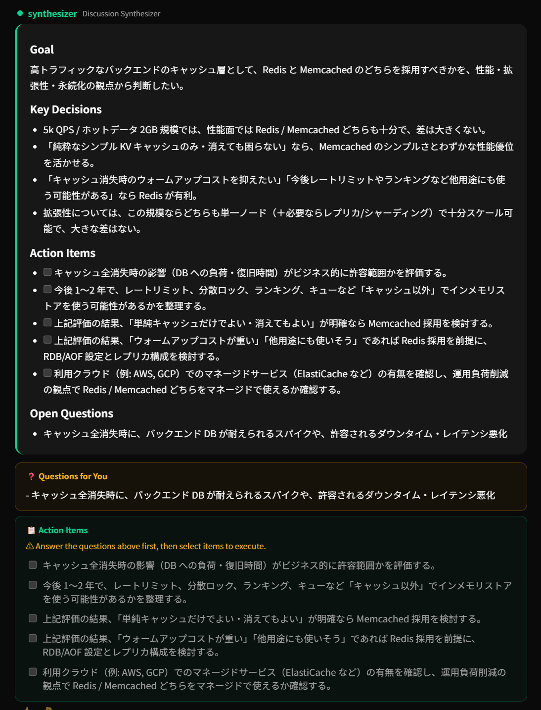

# 🏛 Agora

[English](README.md) | [中文](README_zh.md) | **日本語**

**マルチエージェントAI — 議論し、決定し、タスクを実行する。**

> 高トラフィックなバックエンドサービス（約 5k QPS、ホットデータ約 2GB）を作っています。
> キャッシュには Redis と Memcached のどちらを使うべきでしょうか。
> 性能、拡張性、永続化の観点でトレードオフを知りたいです。



オープンソースAIシステム。複数のエージェントが異なる視点から問題を議論し、実際にソリューションを構築します。

## なぜ Agora？

- 🏛 **チャットボットではなくカウンシル** — 複数のエージェントが異なる角度から問題を議論してから行動します。
- 🔧 **議論 → 実行** — エージェントはアドバイスだけではありません。ファイルの作成、コマンドの実行、計画の実装が可能です。
- 🧠 **自己進化** — 議論と実行が再利用可能なスキルに変換されます。
- ⚙️ **カスタマイズ可能** — YAMLで独自のエージェント、プロンプト、モデルを定義できます。
- 🔌 **モデル非依存** — OpenAI、Azure OpenAI、Claude CLI、Gemini CLI、Kiro CLI、OpenAI互換API。
- 🐳 **セルフホスト** — Dockerで実行し、データを完全に管理できます。

## クイックスタート

### Docker

```bash
git clone https://github.com/wilbur-labs/Agora.git
cd Agora
cp .env.example .env  # .envを編集し、APIキーを追加
docker compose up -d
```

### ローカル開発

```bash
git clone https://github.com/wilbur-labs/Agora.git
cd Agora
cp .env.example .env  # .envを編集し、APIキーを追加
make install
make dev
```

## 設定例

```yaml
models:
  gpt4o:
    provider: azure-openai
    api_key: ${AZURE_OPENAI_API_KEY}
    base_url: ${AZURE_OPENAI_BASE_URL}
    deployment: gpt-4o-0513

council:
  default_agents: [scout, architect, critic]
  model: gpt4o
  executor_model: gpt4o
  concurrent: false
```

## 仕組み

```
ユーザー入力
  → Moderator ルーティング: QUICK / DISCUSS / EXECUTE / CLARIFY
    → QUICK: 単一エージェントが直接回答
    → DISCUSS:
        Scout → Architect → Critic → Synthesizer
        → ユーザーがアクションアイテムを確認
        → Executor がツール呼び出しループを実行
        → 議論 + 実行スキルを学習
    → EXECUTE:
        → Executor がツール呼び出しループを直接実行
        → 実行スキルを学習
```

## カウンシルエージェント

| エージェント | 役割 |
|-------------|------|
| Moderator | リクエストのルーティング |
| Scout | リサーチとエビデンス収集 |
| Architect | システム設計とソリューション計画 |
| Critic | レビューと前提の検証 |
| Sentinel | セキュリティレビュー |
| Synthesizer | 決定とアクションアイテムの要約 |
| Executor | ツール実行 |

## 組み込みツール

| ツール | 説明 |
|--------|------|
| read_file | ファイル内容の読み取り |
| write_file | ファイルの作成または上書き |
| patch_file | ファイルの特定内容を更新 |
| list_dir | ディレクトリ内容の一覧 |
| shell | シェルコマンドの実行 |

## 自己学習

Agoraはすべてのインタラクションから学習します：

- **議論スキル** — 意思決定パターンと有用な視点をキャプチャ
- **実行スキル** — ステップバイステップの実装知識をキャプチャ
- **メモリ** — 再利用可能なユーザーとプロジェクトのコンテキストを保存
- **成功追跡** — 何が機能し、何が失敗したかを記録

## CLIコマンド

| コマンド | 説明 |
|---------|------|
| `/ask <質問>` | クイック回答 |
| `/exec <タスク>` | 直接実行 |
| `/agents` | カウンシルエージェント一覧 |
| `/skills` | 学習済みスキル一覧 |
| `/memory` | メモリ表示 |
| `/profile` | ユーザープロファイルの表示/設定 |
| `/reset` | 会話コンテキストのクリア |
| `/quit` | 終了 |

## API

```bash
curl -N -X POST http://localhost:8000/api/chat \
  -H "Content-Type: application/json" \
  -d '{"message": "GoプロジェクトのCI/CDパイプラインを設計してください"}'
```

## テスト

```bash
make test
make test-all
```

## ロードマップ

- [x] マルチエージェント議論
- [x] ツール呼び出し実行
- [x] 自己学習スキル
- [x] Dockerサンドボックス
- [x] 複数モデルバックエンド
- [x] Web UI
- [x] ヒューマンインザループ確認
- [ ] MCPサーバー拡張
- [ ] スキルマーケットプレイス

## フィロソフィー

古代アテネでは、Agoraは人々が集まり、議論し、討論し、決定する場所でした。AgoraはこのアイデアをAIに持ち込みます：一つのモデルがすべてを行うのではなく、複数の視点が行動する前に協力します。

## ライセンス

MIT

## 謝辞

- [DeerFlow](https://github.com/bytedance/deer-flow) — サンドボックス実行、メモリシステム、オーケストレーションのインスピレーション
- [Hermes Agent](https://github.com/hermes-agent) — 自己進化スキルと永続メモリのインスピレーション

## お問い合わせ

- 📧 wilbur.ai.dev@gmail.com
- 🐛 [GitHub Issues](https://github.com/wilbur-labs/Agora/issues)
