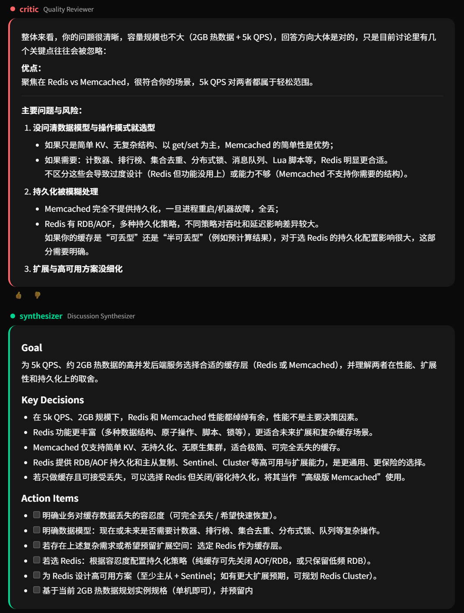

# 🏛 Agora

[English](README.md) | **中文** | [日本語](README_ja.md)

**多智能体 AI，讨论、决策、执行你的任务。**

> 我正在做一个高并发后端服务（约 5k QPS），热数据大约 2GB。
> 缓存层应该选择 Redis 还是 Memcached？
> 它们在性能、扩展性和持久化方面有哪些取舍？



开源 AI 系统，多个智能体从不同视角讨论你的问题，然后真正构建解决方案。

## 为什么选择 Agora？

- 🏛 **议会，不是聊天机器人** — 多个智能体从不同角度讨论你的问题，然后再行动。
- 🔧 **讨论 → 执行** — 智能体不只是建议。它们可以写文件、运行命令、实现方案。
- 🧠 **自我进化** — 讨论和执行被提炼为可复用的技能。
- ⚙️ **完全可定制** — 用 YAML 定义你自己的智能体、提示词和模型。
- 🔌 **模型无关** — OpenAI、Azure OpenAI、Claude CLI、Gemini CLI、Kiro CLI 及 OpenAI 兼容 API。
- 🐳 **自托管** — Docker 一键部署，数据完全掌控。

## 快速开始

### Docker

```bash
git clone https://github.com/wilbur-labs/Agora.git
cd Agora
cp .env.example .env  # 编辑 .env，添加你的 API key
docker compose up -d
```

### 本地开发

```bash
git clone https://github.com/wilbur-labs/Agora.git
cd Agora
cp .env.example .env  # 编辑 .env，添加你的 API key
make install
make dev
```

## 配置示例

```yaml
models:
  gpt4o:
    provider: azure-openai
    api_key: ${AZURE_OPENAI_API_KEY}
    base_url: ${AZURE_OPENAI_BASE_URL}
    deployment: gpt-4o-0513

council:
  default_agents: [scout, architect, critic]
  model: gpt4o
  executor_model: gpt4o
  concurrent: false
```

## 工作原理

```
用户输入
  → Moderator 路由: QUICK / DISCUSS / EXECUTE / CLARIFY
    → QUICK: 单个智能体直接回答
    → DISCUSS:
        Scout → Architect → Critic → Synthesizer
        → 用户确认行动项
        → Executor 执行工具调用循环
        → 学习讨论 + 执行技能
    → EXECUTE:
        → Executor 直接执行工具调用循环
        → 学习执行技能
```

## 议会智能体

| 智能体 | 角色 |
|--------|------|
| Moderator | 路由请求 |
| Scout | 研究与证据收集 |
| Architect | 系统设计与方案规划 |
| Critic | 审查与质疑假设 |
| Sentinel | 安全审查 |
| Synthesizer | 总结决策与行动项 |
| Executor | 工具执行 |

## 内置工具

| 工具 | 描述 |
|------|------|
| read_file | 读取文件内容 |
| write_file | 创建或覆盖文件 |
| patch_file | 更新文件特定内容 |
| list_dir | 列出目录内容 |
| shell | 执行 Shell 命令 |

## 自我学习

Agora 从每次交互中学习：

- **讨论技能** — 捕获决策模式和有用视角
- **执行技能** — 捕获分步实现知识
- **记忆** — 存储可复用的用户和项目上下文
- **成功追踪** — 记录什么有效、什么失败

## CLI 命令

| 命令 | 描述 |
|------|------|
| `/ask <问题>` | 快速回答 |
| `/exec <任务>` | 直接执行 |
| `/agents` | 列出议会智能体 |
| `/skills` | 列出已学习技能 |
| `/memory` | 查看记忆 |
| `/profile` | 查看/设置用户档案 |
| `/reset` | 清除对话上下文 |
| `/quit` | 退出 |

## API

```bash
curl -N -X POST http://localhost:8000/api/chat \
  -H "Content-Type: application/json" \
  -d '{"message": "为我的 Go 项目设计 CI/CD 流水线"}'
```

## 测试

```bash
make test
make test-all
```

## 路线图

- [x] 多智能体讨论
- [x] 工具调用执行
- [x] 自我学习技能
- [x] Docker 沙箱
- [x] 多模型后端
- [x] Web UI
- [x] 人机协作确认
- [ ] MCP 服务器扩展
- [ ] 技能市场

## 理念

在古雅典，Agora 是人们聚集讨论、辩论和决策的地方。Agora 将这一理念带入 AI：不是一个模型做所有事，而是多个视角在行动前协作。

## 许可证

MIT

## 致谢

- [DeerFlow](https://github.com/bytedance/deer-flow) — 沙箱执行、记忆系统和编排的灵感来源
- [Hermes Agent](https://github.com/hermes-agent) — 自我进化技能和持久记忆的灵感来源

## 联系

- 📧 wilbur.ai.dev@gmail.com
- 🐛 [GitHub Issues](https://github.com/wilbur-labs/Agora/issues)
